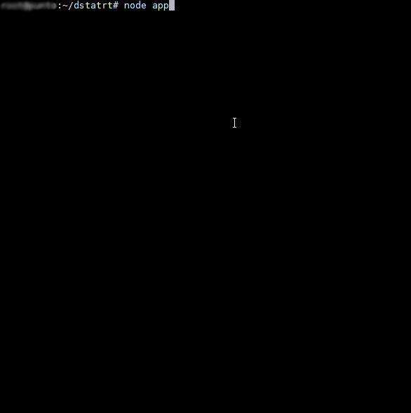

# dstatrt
## Real Time Server and Client for dstat tool using WebSockets
This is a simple WebSockets based Dstat Server & Client. You can run it on your local or remote server, and use it to realtime monitoring.

With a beatifull [Highcharts](http://www.highcharts.com/) lib, this tool becomes very helpfull when you want to do some benchmarks on your server, and to see it as a graph, rather then dry numbers.

DRAFT!!!!

To install it on the server:

1. Install dstat
2. Install additional plugins just by copying .py files from any repository to  /usr/share/dstat/plugins
3. Test it by running "dstat" in console
4. Clone https://github.com/spaiz/dstatrt.git repository or download and unzip https://github.com/spaiz/dstatrt/archive/master.zip
5. Cut & past **dstatrt/client** directory to local storage. This is your web client.
6. Upload **dstatrt** directory to the server without the **client** directory.
7. Install node's modules by typing **npm install** from **dstatrt** directory
6. Run it from **dstatrt** directory by running **node app.js**

Install process. I assume you have node.js, Python and git preinstalled. Run this in terminal as root:

1. apt-get install dstat
2. cd ~
3. git clone https://github.com/spaiz/dstatrt.git
4. cd dstatrt
5. npm install
5. node start.js
6. Open **client/index.html** file in any browser. Best works with Chrome.

You can edit **dstatrt/config.js** file. You can enable/disable dstat plugins, defined enviroment variables for MySQL, Mongodb, Redis ad etc.

Additional notes. To be able to use such helpfull plugins as mysql5-* and mongoddb, you must have this things to be installed.

- "**pip install pymongo**" to be able use --mongodb plugin
- "**apt-get install python-mysqldb**" to be able to use --mysql5-* plugins
- Remember to change login & password for MySQL in dstat/config.js
- Remember to copy mongodb plugin **dstat_mongodb_cmds.py** from https://github.com/gianpaj/dstat/tree/master/plugins to **/usr/share/dstat/plugins/** to be able use plugin **--mongodb-cmds**

Official dstat github:
[https://github.com/dagwieers/dstat](https://github.com/dagwieers/dstat)

You can also download additional plugins (for example dstat_mongodb_cmds.py) from here:
[https://github.com/gianpaj/dstat/tree/master/plugins](https://github.com/gianpaj/dstat/tree/master/plugins)

p.s

Have a problem? Do debug: true in config and run node worker.

1. Problem: No module named MySQLdb

    Solution:
        sudo pip2.7 install MySQL-python

2. Module dstat_memcache_hits failed to load. (Plugin needs the memcache module)

    Solution:
        sudo apt-get install memcached
        sudo apt-get install libmemcached-tools